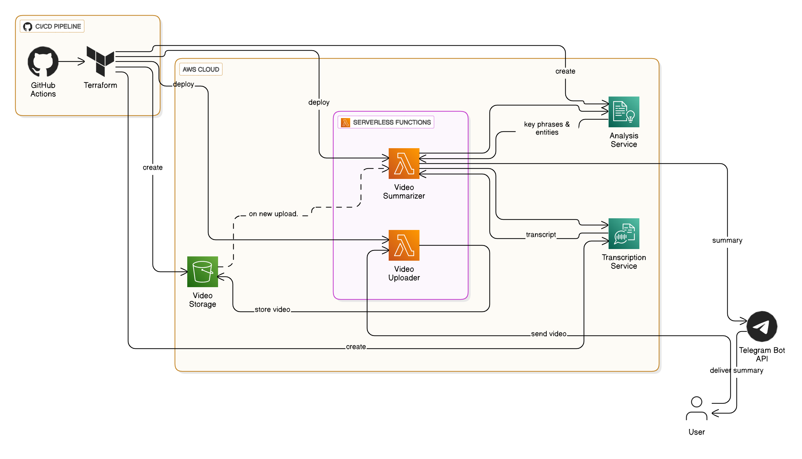

# Telegram Video Summarizer Bot

A serverless Telegram bot that automatically processes video messages, extracts audio, transcribes speech, and generates AI-powered summaries using AWS services.

## 🎯 Features

- **Automatic Video Processing**: Receives video messages from Telegram and processes them automatically
- **Speech-to-Text**: Uses AWS Transcribe to convert video audio to text
- **AI Summarization**: Leverages AWS Comprehend to generate intelligent summaries with key phrases and entities
- **Serverless Architecture**: Built with AWS Lambda for cost-effective scaling
- **Automated Deployment**: GitHub Actions CI/CD pipeline with Terraform

## 🏗️ Architecture

The system consists of two main Lambda functions:

1. **Uploader Lambda**: 
   - Receives Telegram webhook notifications
   - Downloads video files from Telegram servers
   - Uploads videos to S3 storage

2. **Summarizer Lambda**:
   - Triggered automatically when videos are uploaded to S3
   - Extracts audio using FFmpeg
   - Transcribes audio using AWS Transcribe
   - Analyzes and summarizes content using AWS Comprehend
   - Sends formatted summary back to Telegram

## 🛠️ Technology Stack

- **Backend**: Python 3.12, AWS Lambda
- **Infrastructure**: Terraform, AWS S3, AWS Transcribe, AWS Comprehend
- **CI/CD**: GitHub Actions
- **Video Processing**: FFmpeg (via Lambda Layer)
- **Communication**: Telegram Bot API

## 📋 Prerequisites

Before setting up the project, ensure you have:

- AWS account with appropriate permissions
- Telegram Bot Token (from [@BotFather](https://t.me/botfather))
- Your Telegram Chat ID
- GitHub repository with secrets configured
- Terraform installed locally (optional, for manual deployment)

## 🚀 Quick Setup

### 1. Create Telegram Bot

1. Message [@BotFather](https://t.me/botfather) on Telegram
2. Use `/newbot` command and follow instructions
3. Save the bot token provided

### 2. Get Your Chat ID

1. Message your bot or add it to a group
2. Visit: `https://api.telegram.org/bot<YOUR_BOT_TOKEN>/getUpdates`
3. Find your chat ID in the response

### 3. Configure GitHub Secrets

Add the following secrets to your GitHub repository:

| Secret Name | Description |
|-------------|-------------|
| `AWS_ACCESS_KEY_ID` | AWS access key with necessary permissions |
| `AWS_SECRET_ACCESS_KEY` | AWS secret key |
| `AWS_REGION` | AWS region (default: us-east-1) |
| `TELEGRAM_TOKEN` | Your Telegram bot token |
| `TELEGRAM_CHAT_ID` | Your Telegram chat ID |
| `S3_BUCKET_NAME` | S3 bucket name for video storage |

### 4. Deploy

Simply push to the `main` branch or trigger the GitHub Action manually. The deployment pipeline will:

- Build and package Lambda functions
- Deploy infrastructure using Terraform
- Configure Telegram webhook automatically

## 📁 Project Structure

```
├── deploy.yaml              # GitHub Actions workflow
├── main.tf                  # Main Terraform configuration
├── variables.tf             # Terraform variables
├── summarizer_lambda.py     # Video processing and summarization logic
├── uploader_lambda.py       # Telegram webhook handler
└── README.md               # This file
```

## 🔧 Configuration

### Environment Variables

The Lambda functions use the following environment variables:

**Uploader Lambda:**
- `TELEGRAM_BOT_TOKEN`: Your bot token
- `S3_BUCKET_NAME`: S3 bucket for video storage

**Summarizer Lambda:**
- `BOT_TOKEN`: Your bot token
- `CHAT_ID`: Your chat ID for receiving summaries
- `S3_BUCKET_NAME`: S3 bucket for video storage

### AWS Resources Created

- **S3 Bucket**: Stores uploaded videos and temporary audio files
- **Lambda Functions**: Two functions for upload and summarization
- **IAM Roles**: Least-privilege access for Lambda functions
- **Function URL**: Public endpoint for Telegram webhooks
- **S3 Event Notifications**: Triggers summarization on upload

## 📊 Usage

1. Send a video message to your Telegram bot
2. The bot automatically:
   - Downloads and stores the video
   - Extracts audio using FFmpeg
   - Transcribes speech to text
   - Analyzes content for key phrases and entities
   - Generates a structured summary
   - Sends the summary back to you

### Example Summary Format

```
📋 Meeting Summary:

• Key point from the discussion about project timeline
• Important decision made regarding budget allocation  
• Action items assigned to team members
• Next meeting scheduled for next week

🔑 Key Topics: project timeline, budget, team meeting
👥 Mentioned: John Smith, Marketing Department, Q4 Goals
```

## 🔒 Security & Permissions

The project follows AWS security best practices:

- **Least Privilege**: IAM roles have minimal required permissions
- **Resource Isolation**: Each Lambda has specific S3 access patterns
- **Secure Storage**: Sensitive data stored as environment variables
- **Automatic Cleanup**: Temporary files are automatically deleted

### Required AWS Permissions

**Uploader Lambda:**
- `s3:PutObject` on the videos bucket
- CloudWatch Logs permissions

**Summarizer Lambda:**
- `s3:GetObject`, `s3:DeleteObject` on videos bucket
- `s3:PutObject` on audio_temp folder
- `transcribe:*` for speech-to-text
- `comprehend:DetectKeyPhrases`, `comprehend:DetectEntities`
- CloudWatch Logs permissions

## 🚨 Troubleshooting

### Common Issues

1. **Webhook Setup Failed**
   - Manually set webhook: `curl -X POST https://api.telegram.org/bot<TOKEN>/setWebhook?url=<FUNCTION_URL>`
   - Check function URL in AWS Console

2. **Transcription Timeout**
   - Increase Lambda timeout in `main.tf`
   - Check video length (very long videos may exceed limits)

3. **Permission Errors**
   - Verify IAM roles have correct policies attached
   - Check CloudWatch logs for specific error messages

4. **Deployment Issues**
   - Ensure all GitHub secrets are correctly configured
   - Verify Terraform state bucket exists and is accessible

### Monitoring

- Check CloudWatch logs for both Lambda functions
- Monitor S3 bucket for stuck or failed uploads
- Use `getWebhookInfo` to verify Telegram webhook status

## 💰 Cost Considerations

This serverless architecture is cost-effective for moderate usage:

- **Lambda**: Pay per execution (free tier: 1M requests/month)
- **S3**: Storage costs for videos (temporary, deleted after processing)
- **Transcribe**: ~$0.024 per minute of audio
- **Comprehend**: ~$0.0001 per unit (100 characters)

## 🤝 Contributing

1. Fork the repository
2. Create a feature branch
3. Make your changes
4. Test thoroughly
5. Submit a pull request

## 📝 License

This project is open source and available under the MIT License.

## 🔗 Useful Links

- [Telegram Bot API Documentation](https://core.telegram.org/bots/api)
- [AWS Lambda Documentation](https://docs.aws.amazon.com/lambda/)
- [AWS Transcribe Documentation](https://docs.aws.amazon.com/transcribe/)
- [AWS Comprehend Documentation](https://docs.aws.amazon.com/comprehend/)
- [Terraform AWS Provider](https://registry.terraform.io/providers/hashicorp/aws/latest/docs)